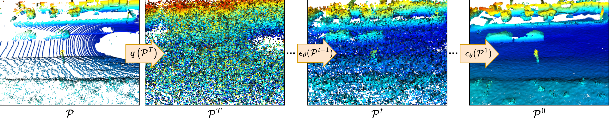

# Scaling Diffusion Models to Real-World 3D LiDAR Scene Completion

**[Paper](http://www.ipb.uni-bonn.de/pdfs/nunes2024cvpr.pdf)** **|** **[Sup. material](http://www.ipb.uni-bonn.de/pdfs/nunes2024cvpr-supmaterial.pdf)** **|** **[Video](https://www.youtube.com/watch?v=XWu8svlMKUo)**

This repo contains the code for the scene completion diffusion method proposed in the CVPR'24 paper: "Scaling Diffusion Models to Real-World 3D LiDAR Scene Completion".

Our method leverages diffusion process as a point-wise local problem, disentangling the scene data distribution during in the diffusion process, learning only the point local neighborhood distribution. From our formulation we
can achieve a complete scene representation from a single LiDAR scan directly operating over the 3D points.



## Dependencies

Installing python (we have used python 3.8) packages pre-requisites:

`sudo apt install build-essential python3-dev libopenblas-dev`

`pip3 install -r requirements.txt`

Installing MinkowskiEngine:

`pip3 install -U MinkowskiEngine==0.5.4 --install-option="--blas=openblas" -v --no-deps`

To setup the code run the following command on the code main directory:

`pip3 install -U -e .`

## SemanticKITTI Dataset

The SemanticKITTI dataset has to be download from the official [site](http://www.semantic-kitti.org/dataset.html#download) and extracted in the following structure:

```
./lidiff/
└── Datasets/
    └── SemanticKITTI
        └── dataset
          └── sequences
            ├── 00/
            │   ├── velodyne/
            |   |       ├── 000000.bin
            |   |       ├── 000001.bin
            |   |       └── ...
            │   └── labels/
            |       ├── 000000.label
            |       ├── 000001.label
            |       └── ...
            ├── 08/ # for validation
            ├── 11/ # 11-21 for testing
            └── 21/
                └── ...
```

## Ground truth generation

To generate the ground complete scenes you can run the `map_from_scans.py` script. This will use the dataset scans and poses to generate the sequence map to be used as ground truth during training:

```
python3 map_from_scans.py --path Datasets/SemanticKITTI/dataset/sequences/
```

Once the sequences map is generated you can then train the model.

## Training the diffusion model

For training the diffusion model, the configurations are defined in `config/config.yaml`, and the training can be started with:

`python3 train.py`

For training the refinement network, the configurations are defined in `config/config_refine.yaml`, and the training can be started with:

`python3 train_refine.py`

## Trained model

You can download the trained model weights and save then to `lidiff/checkpoints/`:

- Diffusion model [weights](https://www.ipb.uni-bonn.de/html/projects/lidiff/diff_net.ckpt)
- Refinement model [weights](https://www.ipb.uni-bonn.de/html/projects/lidiff/refine_net.ckpt)

## Diffusion Scene Completion Pipeline

For running the scene completion inference we provide a pipeline where both the diffusion and refinement network are loaded and used to complete the scene from an input scan. You can run the pipeline with the command:

`python3 tools/diff_completion_pipeline.py --diff DIFF_CKPT --refine REFINE_CKPT -T DENOISING_STEPS -s CONDITIONING_WEIGHT`

We provide one scan as example in `lidiff/Datasets/test/` so you can directly test it out with our trained model by just running the code above.

## Citation

If you use this repo, please cite as :

```bibtex
@inproceedings{nunes2024cvpr,
    author = {Lucas Nunes and Rodrigo Marcuzzi and Benedikt Mersch and Jens Behley and Cyrill Stachniss},
    title = {{Scaling Diffusion Models to Real-World 3D LiDAR Scene Completion}},
    booktitle = {{Proc. of the IEEE/CVF Conf. on Computer Vision and Pattern Recognition (CVPR)}},
    year = {2024}
}
